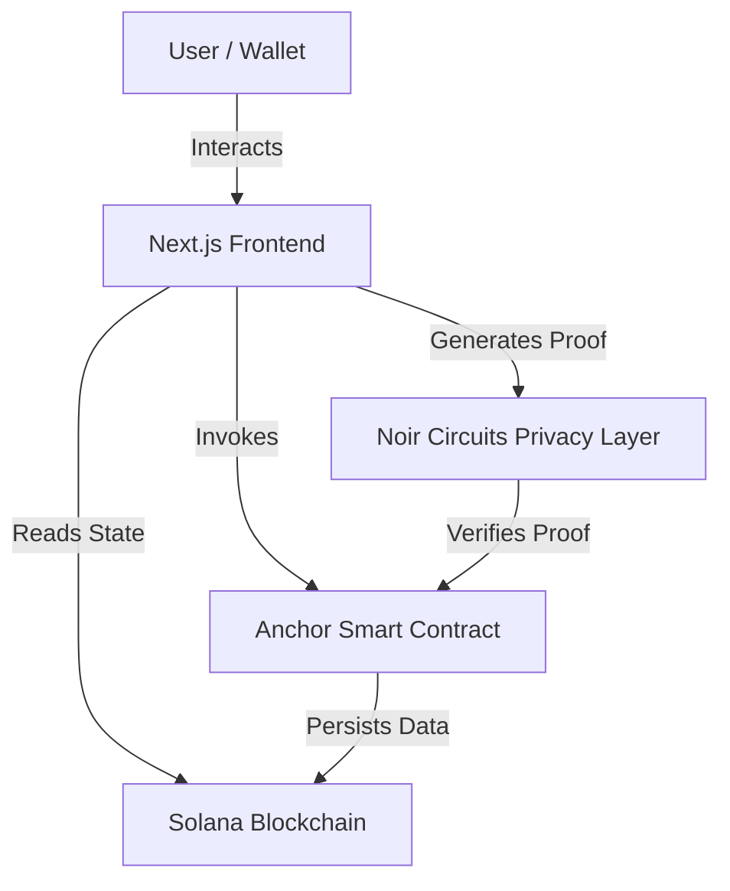
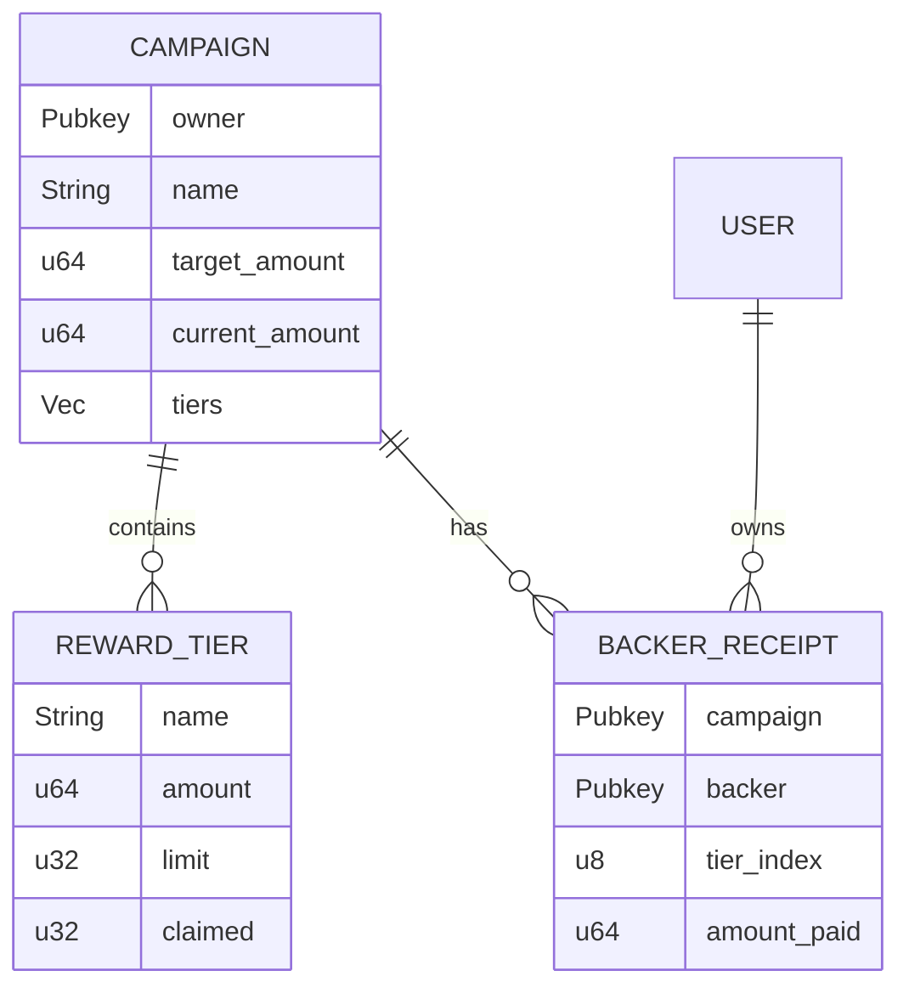

# ShadowFund Architecture & Privacy Design

## 1. Architecture Overview

ShadowFund is built on a hybrid architecture combining a transparent **Solana (Anchor)** smart contract layer with a privacy-preserving **Zero-Knowledge (ZK)** coordination layer.

### System Components

-   **Frontend**: A Next.js application that manages user interaction, wallet connection, and proof generation.
-   **Smart Contract**: An Anchor program that manages Campaign state, Reward Tiers, and Backer Receipts.
-   **Privacy Layer (ShadowWire)**: A set of ZK circuits (written in Noir) that allow users to prove they made a deposit without revealing their identity on the public campaign ledger.

---

## 2. On-Chain Data Storage

ShadowFund uses Solana's account model with **Program Derived Addresses (PDAs)** to organize data efficiently and securely.

### Core Accounts

| Account Type | Seeds | Purpose |
| :--- | :--- | :--- |
| **Campaign** | `b"campaign", owner_pubkey, campaign_id` | Stores campaign metadata, target, deadline, and the vector of `RewardTier`s. |
| **RewardTier** | *Stored inside Campaign* | Defines tiers (Name, Amount, Limit, Claimed Count). |
| **Backer** | `b"backer", campaign_id, backer_pubkey` | A "Soulbound" receipt proving a user backed a campaign. Acts as the claim ticket. |
| **PlatformConfig** | `b"config"` | Global settings (Treasury address, Fee %). |

### Entity Relationship Diagram

---

## 3. Privacy Architecture (Comparison with Native Solana)

### Native Solana Crowdfunding (Public)
In a standard Solana crowdfunding app, the donation flow is fully transparent:
1.  User A sends 5 SOL to Campaign B.
2.  The transaction is recorded on-chain: `User A -> Campaign B (5 SOL)`.
3.  **Privacy Leak**: Anyone observing the blockchain knows exactly who supported the campaign and how much they gave.

### ShadowFund "ShadowWire" Architecture (Private)
ShadowFund decouples the **Payment** from the **attribution** using a Shielded Pool mechanism (conceptually similar to Tornado Cash but compliant).

#### The Flow:
1.  **Deposit**: User deposits SOL into a shared "ShadowPool" contract. They receive a secret "Note" (off-chain).
    *   *On-chain*: `User A -> ShadowPool (5 SOL)`.
    2.  **Wait**: The pool mixes funds from many users.
3.  **Donate/Transfer**: When the user wants to back a campaign, they generate a **Zero-Knowledge Proof** locally.
    *   The proof states: "I possess a valid note for 5 SOL in the pool, and I authorize moving it to Campaign B."
    *   Crucially, the proof **does not reveal** which specific note is being spent.
4.  **Execution**: The ShadowPool verifies the proof and transfers funds to Campaign B.
    *   *On-chain*: `ShadowPool -> Campaign B (5 SOL)`.

#### Why it is Private
-   **Observer View**: An observer sees money entering the pool from many users, and money leaving the pool to many campaigns. They cannot link a specific input (User A) to a specific output (Campaign B).
-   **Backer Receipt**: The `Backer` PDA allows the user to *voluntarily* reveal their support to the campaign creator (e.g., to claim a reward) without exposing the payment trail to the entire world.

---

## 4. Implementation Status

### Current State: Mocked Privacy

> [!CAUTION]
> The current implementation is a **prototype with simulated privacy**. Real zero-knowledge proofs are NOT yet integrated.

| Component | Current Implementation | Real Privacy? |
|-----------|----------------------|---------------|
| **Deposit** | Direct: `User Wallet → Campaign` | ❌ No - Wallet visible on-chain |
| **Proof** | Wallet signature of nullifier | ❌ No - Not a ZK proof |
| **Nullifier** | Random bytes | ❌ No - No real double-spend protection |
| **Anonymity Set** | None (1:1 mapping) | ❌ No |
| **Backer Receipt** | Optional PDA (stealth mode skips it) | ⚠️ Partial |

**What "Stealth Mode" currently does:**
- Skips creating the `Backer` PDA, so the campaign owner cannot enumerate backers via PDAs.
- Does NOT hide the transaction: An on-chain observer can still see `User Wallet → Campaign PDA`.

### Target State: True ShadowWire

| Component | Target Implementation | Real Privacy? |
|-----------|----------------------|---------------|
| **Deposit** | `User Wallet → ShadowPool` | ✅ Yes - Joins anonymity set |
| **ZK Proof** | Noir circuit proving valid deposit | ✅ Yes - Cryptographic guarantee |
| **Nullifier** | `Hash(secret)` | ✅ Yes - Prevents double-spend |
| **Withdraw** | `ShadowPool → Campaign` | ✅ Yes - Unlinked from depositor |
| **Backer Receipt** | Minted to fresh wallet | ✅ Yes - Selective disclosure |

---

## 5. Privacy Analysis: The "Claiming Leak"

You may notice that the `Backer` PDA includes the `backer` public key (`b"backer", campaign_id, backer_pubkey`). 

**Does this leak privacy?** 

-   **In Current Prototype**: Yes, because the donation wallet and the claiming wallet are the same.
-   **In Full ShadowWire System**: No. The power of ZK is that you can prove you funded the pool *without* revealing which wallet did it:
    1.  User Funds Pool (Wallet A).
    2.  User Generates ZK Proof locally.
    3.  User Claims Reward (Wallet B - A fresh, anonymous wallet). 
    
    The `Backer` receipt is minted to Wallet B. The public sees `Wallet B supported Campaign X`, but cannot link it back to Wallet A (the source of funds). This enables **Selective Disclosure** of support.

